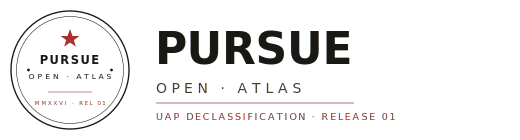
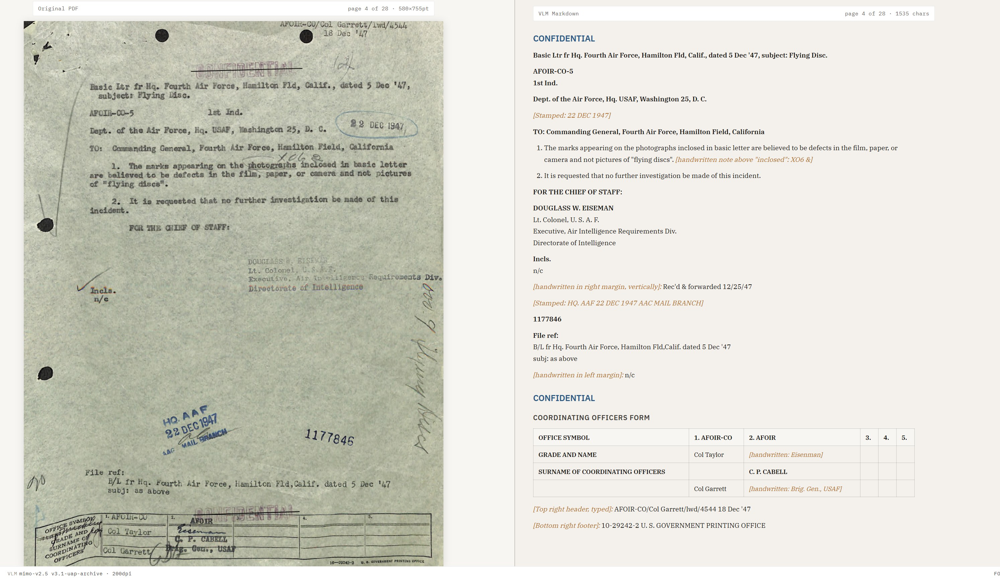
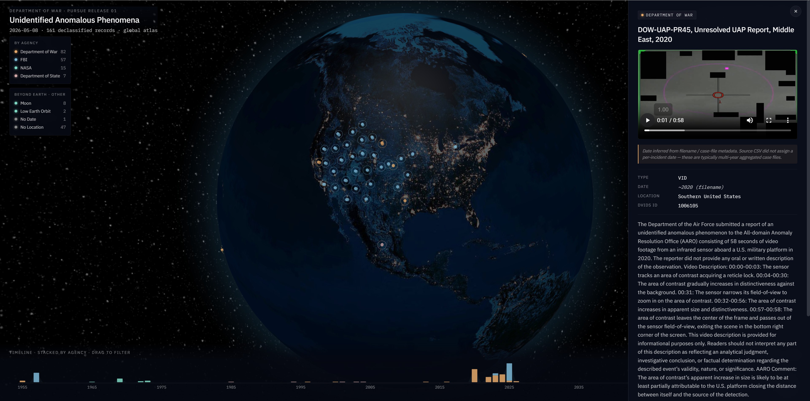
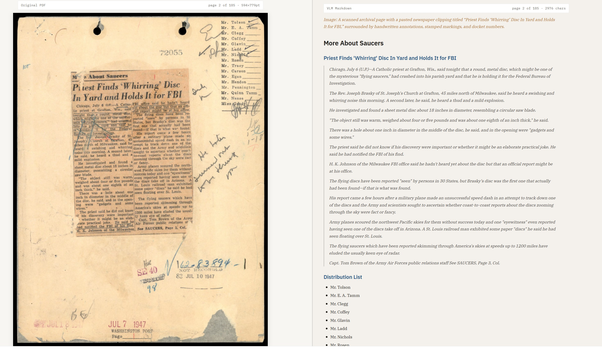
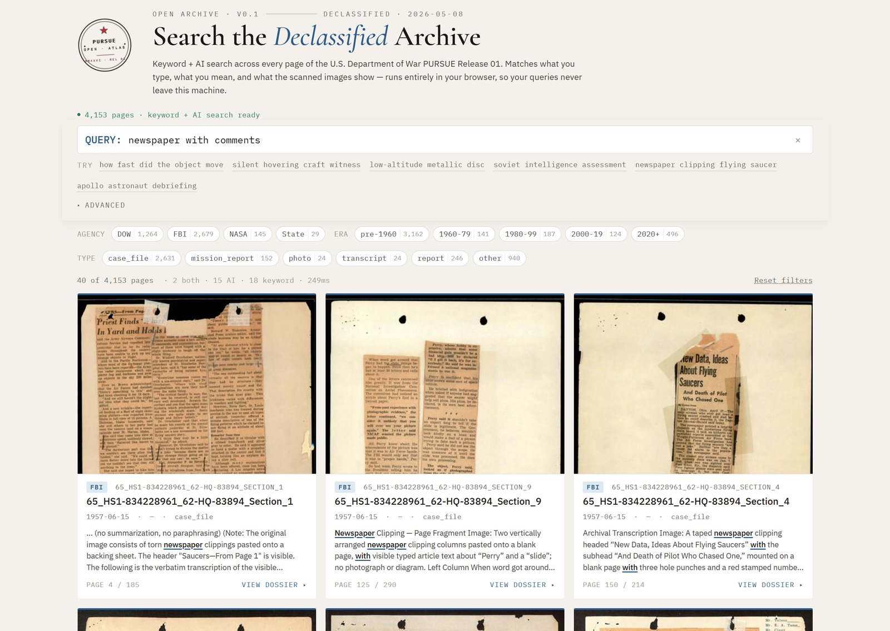

<p align="center">
  
</p>

<p align="center">
  <em>The U.S. Department of War <strong>PURSUE Release 01</strong> UFO / UAP declassification, re-extracted into <strong>cleaned Markdown with inline image captions</strong> — every photograph, sketch, rubber stamp, and handwritten margin note becomes an <code>*Image: ...*</code> block in the same text stream. Interleaved image-text data derived from 80 years of declassified gov documents, with per-page JPEG renders, interactive 3D atlas, and a fully client-side <strong>keyword + AI hybrid search</strong>. All CC0.</em><br>
  <sub>161 records · 4,153 pages · ~2 GB image data · 2026-05-11 · v0.2</sub>
</p>

<p align="center">
  <a href="https://huggingface.co/datasets/alex-zhang42/ufo-pursue-open-atlas">
    
  </a>
  <a href="https://ufo.gpt2077.com/search.html">
    
  </a>
  <a href="https://ufo.gpt2077.com/">
    
  </a>
  <a href="./LICENSE">
    
  </a>
</p>

<p align="center">
  <a href="#get-started">Get started</a> ·
  <a href="#search-interface-v02">Search</a> ·
  <a href="#what-it-looks-like">Screenshots</a> ·
  <a href="#schema-one-record-per-page">Schema</a> ·
  <a href="#why-not-just-use-the-embedded-pdf-text">Why VLM</a> ·
  <a href="#considerations-for-using-the-data">Considerations</a> ·
  <a href="#citing">Cite</a>
</p>

---

## What's in here

| Artifact | Size | What it is |
|---|---|---|
| **`corpus.jsonl`** | 14 MB / 4,153 rec | Per-page Markdown with inline `*Image: ...*` descriptions for every photograph, sketch, stamp, handwritten note. One JSON object per line. The form shipped on this GitHub repo. |
| **`pages/train-*-of-00005.parquet`** (5 shards, **on HF only**) | ~2.0 GB | Same per-record fields as `corpus.jsonl` plus an `image` column carrying the 200 DPI JPEG bytes inline as the leftmost column. Built locally by `scripts/build_parquet_shards.py`; published on the [🤗 Hub](https://huggingface.co/datasets/alex-zhang42/ufo-pursue-open-atlas) as the `pages` config (gitignored on GitHub — too large for git). `load_dataset(..., "pages")` returns decoded PIL.Image objects directly. |
| **`mimo_processed/`** | 25 MB | Per-page Markdown sources (one directory per PDF, with `_meta.json` provenance). |
| **`image_audit/`** | 8 MB | Per-page audit JSON — mimo judge scores plus GPT-mini outputs. |
| **`web/`** | ~140 MB | Plain HTML + JS for the **3D globe atlas**, the **side-by-side dataset viewer**, and the v0.2 **keyword + AI search**. Includes precomputed search index (`web/search_index/`, ~13 MB) and 400 px page thumbnails (`web/thumbs/`, ~125 MB) so first-load works offline. No build step, runs on any static server. |
| **`pipeline/` + `scripts/`** | source | Full extract → audit → fallback → render → build → validate pipeline, plus `build_search_index.py` / `build_thumbnails.py` for the v0.2 search artifacts and `search_cli.py` for offline retrieval QA. |
| **`corrections.json`** | 20 KB | Every metadata correction (4 location fixes, 1 date fix, 56 inferred N/A dates) with rationale. |

License: [CC0 1.0](./LICENSE). Source documents are works of the U.S.
federal government, already public domain under 17 U.S.C. §105.

---

## Get started

### Load the corpus
Two configs — pick by what you need:

```python
from datasets import load_dataset

# text + metadata (default; ~14 MB, fast)
ds = load_dataset("alex-zhang42/ufo-pursue-open-atlas", split="train")
print(ds[0]["text"][:200])

# text + metadata + decoded page image (~2 GB across 5 parquet shards)
ds = load_dataset("alex-zhang42/ufo-pursue-open-atlas", "pages", split="train")
print(ds[0]["text"][:200])
print(ds[0]["image"])  # PIL.Image, already decoded
```

Field map is in [Schema](#schema-one-record-per-page) below; full reference in [`schema.md`](./schema.md).

### Run the atlas + viewer + search locally
The `web/` directory is plain HTML + JS — no build, no Node, no install.
```bash
git clone https://github.com/AlexZhangji/ufo-pursue-open-atlas
cd ufo-pursue-open-atlas
python3 -m http.server 8000 --directory web/
```
Then open:
- `http://localhost:8000/` — **3D globe atlas** (all 161 records by agency × time × location)
- `http://localhost:8000/dataset.html` — **side-by-side viewer** (every PDF page next to its VLM Markdown)
- `http://localhost:8000/search.html` — **keyword + AI hybrid search** (v0.2; details [below](#search-interface-v02))

### Or browse online
Hosted mirror of the same `web/` directory at:
- <https://ufo.gpt2077.com/> — atlas
- <https://ufo.gpt2077.com/dataset.html> — side-by-side viewer
- <https://ufo.gpt2077.com/search.html> — search (v0.2)

### Walk per-PDF (if you cloned the repo)
```python
import json, pathlib
for meta in pathlib.Path("mimo_processed").glob("*/_meta.json"):
    for page_md in meta.parent.glob("page_*.md"):
        text = page_md.read_text(encoding="utf-8")
        ...
```

---

## What it looks like

<p align="center">
  
</p>

<p align="center">
  <em>Side-by-side viewer (run locally, or <a href="https://ufo.gpt2077.com/dataset.html">hosted mirror</a>). Every page of every PDF on the left, cleaned VLM Markdown on the right — every claim in the corpus is one click from its source page.</em>
</p>

<p align="center">
  
</p>

<p align="center">
  <em>3D globe atlas (run locally, or <a href="https://ufo.gpt2077.com/">hosted mirror</a>). 161 records colored by agency, jittered so dense locations stay individually clickable, time-linked to a brushable 80-year histogram.</em>
</p>

---

## What the Markdown layer preserves

Every page is VLM-extracted into clean Markdown. **Every photograph,
sketch, diagram, chart, rubber stamp, and handwritten margin note
becomes an inline `*Image: <factual description>*` block in the same
text stream.** The Markdown carries:

- **Structural text** — headings, body, numbered + bulleted lists, block quotes
- **Tables** — form fields, distribution lists, signature blocks rendered as proper Markdown tables
- **Classification banners** — `## UNCLASSIFIED` / `## CONFIDENTIAL` / `## SECRET` as Markdown headings
- **Image content** — inline `*Image: <factual description>*` blocks
- **Rubber + ink stamps** — quoted verbatim and tagged inline
- **Handwritten annotations** — preserved as `*[handwritten: ...]*` italics where they appear in the page flow
- **Redactions** — black-bar redactions noted as `[REDACTED]` with surrounding context
- **Margin annotations + page numbers** — kept as italic asides

86.6% of the 4,153 source PDF pages have **zero native text** — they
are image-only scans. For those pages this Markdown layer is the only
source of searchable text. See [Why not just use the embedded PDF
text?](#why-not-just-use-the-embedded-pdf-text) below for the
empirical sweep.

<p align="center">
  
</p>

<p align="center">
  <em>1947 FBI archival page mounting a newspaper clipping ("Priest Finds 'Whirring' Disc..."), with a handwritten FBI distribution list down the right margin. The Markdown layer preserves: full article body transcribed verbatim under a "More About Saucers" heading; the distribution list rendered as a bulleted list; date stamps captured inline; and an `*Image:*` block describing the page surface. <strong>Native PDF text on this page: 0 chars.</strong></em>
</p>

---

## Search interface (v0.2)

<p align="center">
  
</p>

<p align="center">
  <em>Live at <a href="https://ufo.gpt2077.com/search.html">ufo.gpt2077.com/search.html</a>. Stamp-style header with the same wax-seal emblem on this README, query bar with a row of click-to-fill examples, filter chips annotated with bucket counts (DOW 1,346 · FBI 2,417 · ...), and a multi-column grid of result cards. Default query ships as <code>newspaper clipping flying saucer</code> so first-load shows the corpus's most visually distinctive pages.</em>
</p>

Hybrid <strong>keyword + AI</strong> search across every page of every PDF. Both retrievers run in the browser — no server, no telemetry, query string never leaves your machine.

| Layer | What it does | Tech |
|---|---|---|
| Keyword (BM25) | Exact + prefix + fuzzy match over `title`, `text`, `image_tags`, `agency`, `incident_location` with field-weighted boosts. Catches named entities ("Apollo 17", "Section 4"). | [MiniSearch](https://lucaong.github.io/minisearch/) |
| AI (dense vector) | 384-dim semantic match using <a href="https://huggingface.co/BAAI/bge-small-en-v1.5">bge-small-en-v1.5</a> embeddings. Query is encoded in-browser via transformers.js; page vectors are precomputed offline. Catches paraphrased queries ("how fast did the object move" → 1350 MPH page with zero word overlap). | [transformers.js](https://huggingface.co/docs/transformers.js) |
| Fusion | Per-query min-max normalize both score lists, weighted sum (default <code>keyword 0.6 / AI 0.4</code>). Slider in **Advanced** to retune live. | — |

**Other niceties**: page thumbnails inline · markdown-stripped readable snippets with query-term highlighting · `?q=...` URL state · agency / era / record-type filter chips with bucket counts · service-worker offline cache (~13 MB index + ~25 MB ONNX model, both cached after first load).

### Rebuild the search index
Only needed if you change `corpus.jsonl` or want to retune the embedding model.

```bash
uv sync                                  # installs fastembed + numpy + the rest
python scripts/build_thumbnails.py       # → web/thumbs/  (~125 MB · 4153 JPEGs)
python scripts/build_search_index.py     # → web/search_index/  (~13 MB total)
```

Total runtime ~6 min on a 2024 laptop CPU (no GPU needed; fastembed uses ONNX). Sanity-check retrieval quality before deploying:

```bash
python scripts/search_cli.py "how fast did the object move"
python scripts/search_batch.py    # batch eval of 12 candidate UI queries
```

### Retrieval honesty
- Tested at **page granularity** — median page is 369 tokens, comfortably within BGE's 512-token window; ~15% of long pages (NASA debriefings, FBI thick volumes) get tail-truncated by the encoder.
- BM25 here is **bag-of-words**: phrasal queries like "intelligence assessment" don't score for adjacency. Dense retrieval covers most of that gap; if you need true phrase matching, the easiest path is bigram tokenization on the MiniSearch side (~30 min).
- English only — the corpus and embedding model are both English.

---

## Schema (one record per page)

```json
{
  "pdf_stem": "065_HS1-834228961_62-HQ-83894_Section_4",
  "page_num": 191,
  "source_url": "https://www.war.gov/medialink/ufo/release_1/...",
  "sha256": "022b27...",
  "agency": "FBI",
  "year": 1949,
  "year_inferred": false,
  "title": "FBI 62-HQ-83894 Section 4",
  "incident_location": "Virginia, USA",
  "text": "## UNCLASSIFIED\n\n*Image: A clipped newspaper article titled...*\n\n...",
  "vlm_model": "mimo-v2.5",
  "vlm_prompt_version": "v3.1-uap-archive",
  "image_tag_source": "gpt-5.4-mini-2026",
  "image_tag_audit_score": 1
}
```

`image_tag_source` is `mimo-v2.5` for the majority of pages with image
tags and `gpt-5.4-mini-2026` for the 515 pages where mimo's first pass
showed inconsistencies (263 in the original audit batch + 252 in a
second batch of pages mimo had mis-categorized as
`stamp_or_label_only` / `typed_text_only` despite genuine visual
content). See [DATA_CARD.md](./DATA_CARD.md) for full audit
methodology.

### Data fields

Full reference + nullability rules in [`schema.md`](./schema.md).

| Field | Type | What it is |
|---|---|---|
| `record_id` / `pdf_stem` | string | Stable per-record key. Maps 1:1 to `mimo_processed/<stem>/`. |
| `page_num` / `total_pages` | int | 1-indexed page within the source PDF. |
| `text` | string | Full Markdown of the page, including inline `*Image: ...*` blocks. |
| `text_chars` | int | `len(text)`. |
| `image_tags` | array[string] | Just the inside of each `*Image: ...*` block, in document order. |
| `image_tag_source` | string | `mimo-v2.5` or `gpt-5.4-mini-2026` (515 pages re-described after audit). |
| `image_tag_audit_score` / `_audit_categories` | int / array, nullable | Mimo-judge consistency score (0-3) and strict-extract categories for re-described pages; null otherwise. |
| `source_url` / `sha256` / `file_size_bytes` | string / string / int | Direct war.gov download URL + integrity hash + size of the source PDF. |
| `agency` | string | `Department of War` / `Department of State` / `FBI` / `NASA`. |
| `record_type` | string | `mission_report` / `cable` / `case_file` / `photo` / `imagery` / `report` / `summary` / `transcript` / `other`. |
| `title` | string | Cleaned record title from the master CSV. |
| `incident_location` / `_corrected` | string\|null / bool | Cleaned location, plus a flag if we corrected the source CSV. |
| `incident_date_iso` / `year` / `year_inferred` / `_corrected` | string\|null / int\|null / bool / bool | ISO date if known, year (recovered from filename for the 56 N/A records), and provenance flags. |
| `description_blurb` / `dvids_video_id` | string\|null / string\|null | Source CSV description blurb and paired DVIDS video ID where applicable. |
| `vlm_model` / `vlm_prompt_version` / `vlm_dpi` / `extraction_completed_at` | string / string / int / string | Provenance of the Markdown extraction. |
| `page_image_path` | string\|null | Repo-relative path to the rendered page JPEG. Present in the `text` config; the `pages` config replaces this with an inline `image` column of decoded bytes. |
| `image` | `datasets.Image()` | **Only in the `pages` config.** Decoded JPEG returned as PIL.Image. |
| `page_image_format` / `render_dpi` / `render_max_dim` / `render_jpeg_quality` / `render_version` | string / int / int / int / string, all nullable | Render parameters. `render_version` is bumped when render params change. |

---

## Considerations for using the data

Full limitation list in [DATA_CARD.md §7](./DATA_CARD.md#7-known-limitations).
Five things worth knowing before you use it:

1. **Not a verbatim OCR substitute.** `text` is a VLM re-rendering of
   the source PDF, not the embedded text layer. For any quotation,
   citation, or evidentiary use, verify against the source page — the
   side-by-side viewer makes that one click.
2. **No human in the loop.** Both extraction passes are LLM.
   Subject-matter verification is left to you.
3. **86.6% of the corpus is image-only scanned PDF** with zero native
   text. For those pages the VLM is the only source of `text`. See
   "Why not just use the embedded PDF text?" below.
4. **Image-tag audit is partial.** 515 of 1,236 image-tag pages were
   re-described by `gpt-5.4-mini`; the remaining 721 keep their
   original `mimo-v2.5` description. Treat `image_tag_source` as a
   coverage flag if you are running statistics on image content.
5. **PII in source documents.** Source records are already public
   under 17 USC §105, but they do name living people (State
   Department cables name foreign politicians, FBI case files name
   civilian witnesses). Apply normal care when quoting individuals.

---

## Why not just use the embedded PDF text?

A reasonable question — modern PDF readers extract text "for free", so
a VLM extraction pipeline at first looks redundant. The empirical
answer, swept across all 4,153 pages of the v0.1 corpus with
`pymupdf.page.get_text()`:

| Native text (fitz / pymupdf) | Page count | Share |
|---|---:|---:|
| **Zero chars** (image-only scan, no embedded text) | 3,595 | **86.6%** |
| <50 chars (typically just stamp text or page numbers) | 35 | 0.8% |
| ≥50 chars of real text | 523 | 12.6% |
| └ of those, with detectable OCR glitches¹ | 45 | ~9% of 523 |

¹ Heuristic: `COMFIDEMTIAL` instead of `CONFIDENTIAL`, `E.0.` (zero) instead
of `E.O.`, broken `fl` ligatures fused into surrounding words, etc.

What this means in practice — three sample pages:

| Source page | `pymupdf` native text | VLM Markdown |
|---|---|---|
| FBI 1947 newspaper clipping (62-HQ-83894 §4 p191) | **0 chars** | 2,263 chars: full article transcribed + the surrounding archival page described as inline `*Image:* ...` block |
| 1985 State Dept cable (digital PDF, 059uap00011 p1) | 1,520 chars but reads `"COMFIDEMTIAL"`, `"E.0.: Unknown"`, `"IUNCLASSI Fl ED"` | 1,530 chars, structured: `# UNCLASSIFIED`, `## CONFIDENTIAL`, `**MRN:** 01 MOSCOW 13169`, `**Date/DTG:** Oct 30, 2001` |
| FBI 1947 typewriter letter with handwritten margins (62-HQ-83894 §1 p81) | **0 chars** | 1,898 chars: full letter transcribed + handwritten annotations preserved as inline italics |

The FBI 62-HQ-83894 case file alone is ~2,000 pages and every one
returns empty from native PDF text extraction — there is no fallback
for that subset. For the 12.6% of pages that do carry native text,
the VLM pass adds classification banners as headings, form / cable
headers as Markdown tables, inline image descriptions, and explicit
handling of stamps and handwriting — none of which
`pymupdf.get_text()` produces.

VLM-extracting the entire corpus uniformly (including the digital
13%) keeps schema and quality consistent. The tradeoff is that VLM
output is non-verbatim — see [Considerations](#considerations-for-using-the-data) #1.

---

## Reproducibility

Pipeline runs end-to-end. Each stage is resumable.

```bash
# Setup
uv sync                                  # or: pip install -e .
cp .env.example .env                     # then fill in MIMO_TP_KEY + OPENAI_API_KEY

# Run
python3 scripts/download_from_csv.py uap-csv.csv         # 1. download (war.gov, browser headers required)
python3 pipeline/run_vlm_v3.py                           # 2. VLM Markdown extraction (mimo-v2.5)
python3 pipeline/recheck_images.py --concurrency 4       # 3. image-tag audit pass
python3 pipeline/run_fallback_mini.py --concurrency 4    # 4. gpt-5.4-mini re-describe flagged pages
python3 pipeline/apply_mini_replacements.py              # 5. apply re-descriptions
python3 scripts/render_pages.py -j 4                     # 6. 200 DPI page JPEGs
python3 scripts/build_corpus_jsonl.py                    # 7. build corpus.jsonl
python3 scripts/validate_corpus.py                       # 8. schema check
python3 scripts/build_parquet_shards.py                  # 9. pages-*.parquet shards (multimodal config)
```

Every artifact carries provenance — model, prompt version, DPI, source
sha256, timestamps — in `mimo_processed/<stem>/_meta.json`.

---

## Status

v0.1 covers PURSUE Release 01 (DoW, 2026-05-08): 161 records, 130
PDFs / images, 4,153 extracted pages, 1,236 image-tag pages of which
515 were GPT-mini re-described, all 4,153 pages rendered as 200 DPI
JPEGs. Atlas live at <https://ufo.gpt2077.com/>.

Future PURSUE tranches (Release 02, 03, ...) will be appended on a
rolling basis as DoW publishes them.

---

## Citing

If you use this dataset, the suggested citation is:

```
@dataset{pursue_open_atlas_2026,
  title  = {PURSUE Open Atlas: A clean, machine-readable archive of
            U.S. Department of War declassified UAP records},
  author = {Zhang, Ji},
  year   = {2026},
  url    = {https://github.com/AlexZhangji/ufo-pursue-open-atlas},
  license = {CC0-1.0}
}
```

Or simply: *PURSUE Open Atlas (CC0 1.0). Ji Zhang, 2026.*
